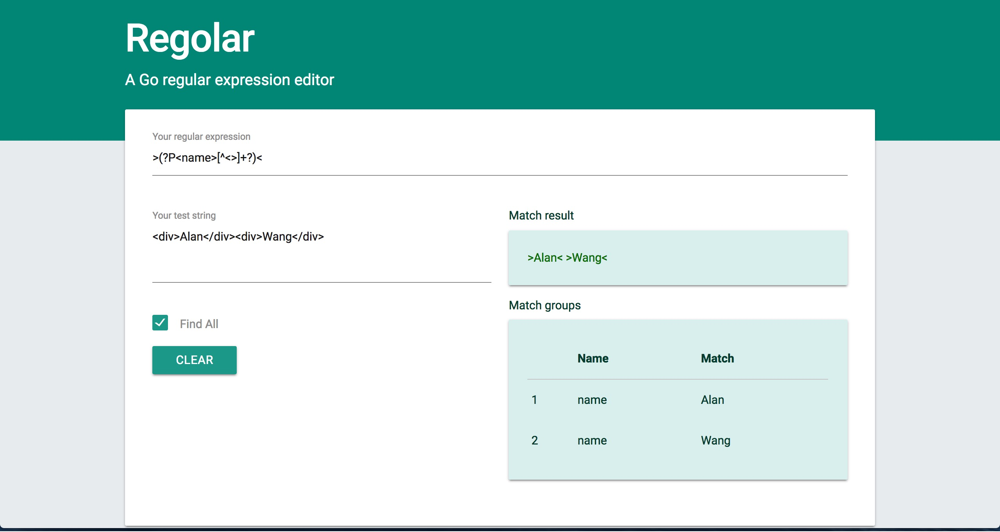
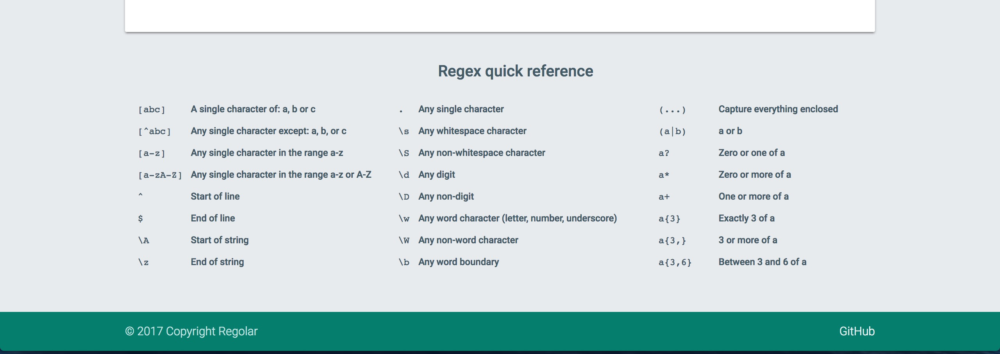

# Regolar
A Go regular expression editor.




## Run
You can build the project in Go directly.
``` shell
go build regolar.go
./regolar
```
Or, you can use `docker run` and run the project on any machine with this command:
``` shell
docker run -p 8080:8080 wlchn/regolar:latest
```
Docker will pull it from the repository .

Server is running at 8080

## License
MIT